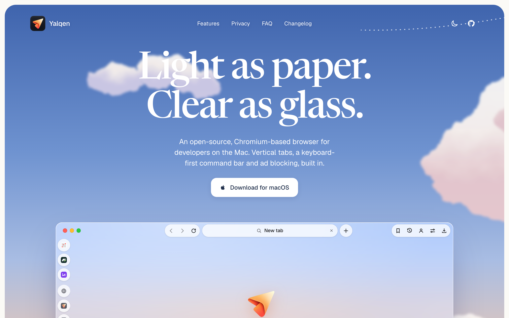

# Yalqen

<a href="https://yalqen.com/">
  <picture>
    <source media="(prefers-color-scheme: dark)" srcset="design/screenshots/website-dark.png" />
    <source media="(prefers-color-scheme: light)" srcset="design/screenshots/website-light.png" />
    
  </picture>
</a>

[](https://yalqen.com/)
[](https://github.com/YSamed/yalqen/actions/workflows/ci.yml)
[](LICENSE)

A fast, privacy-minded web browser for macOS, built with Electron, TypeScript and Svelte.

> **Status:** early prototype. Expect rough edges and breaking changes.

## Features

- Built-in ad and tracker blocking
- HTTPS-only mode and third-party cookie blocking
- Command bar for search, tabs and history
- Pinned tabs that persist across restarts
- Memory saver for inactive tabs
- Developer tools: device and network emulation, storage inspector, request rules and an ephemeral developer window
- Native macOS glass window effect where supported

## Install

Download the latest DMG from [Releases](https://github.com/YSamed/yalqen/releases). Requires macOS 13 or later on Apple Silicon.

Releases are not notarized yet, so macOS blocks the first launch. Open **System Settings › Privacy & Security** and click **Open Anyway**. If macOS reports the app as damaged, run:

```bash
xattr -dr com.apple.quarantine /Applications/Yalqen.app
```

## Development

Requires Node.js 24 and macOS.

```bash
cd apps/browser
npm ci
npm start
```

Run `npm run check` for lint, typecheck and tests, and `npm run package:mac` to build a local DMG/ZIP.

See [RELEASING.md](apps/browser/RELEASING.md) for the release process and [CHANGELOG.md](apps/browser/CHANGELOG.md) for release history.

## Contributing

Contributions are welcome. Read [CONTRIBUTING.md](CONTRIBUTING.md) before opening a pull request, and report security issues as described in [SECURITY.md](SECURITY.md). This project follows the [Code of Conduct](CODE_OF_CONDUCT.md).

## License

Yalqen is released under the [MIT License](LICENSE). Bundled ad-blocking filter lists keep their own licenses; see [THIRD_PARTY_NOTICES.md](apps/browser/THIRD_PARTY_NOTICES.md).

The Yalqen name and logo are not covered by the MIT License and may not be used to endorse or promote derived products without permission.
