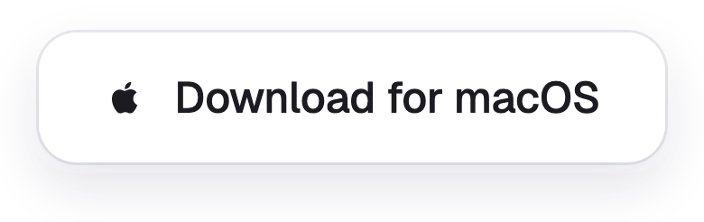
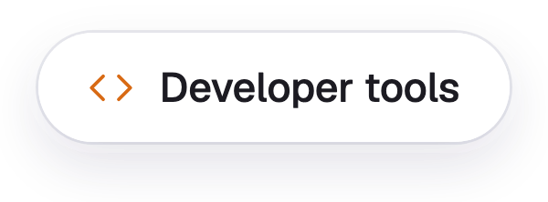
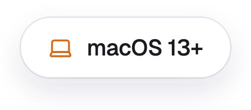

<div align="center">
  

  <h1>Yalqen</h1>

  <p><strong>A fast, privacy-minded web browser for macOS.</strong><br>Open source. Early prototype.</p>

  <p>
    <a href="https://github.com/YSamed/yalqen/releases/latest"></a>
  </p>

  <p>
    <a href="https://yalqen.com/"></a>
    <a href="apps/browser/CHANGELOG.md"></a>
    <a href="CONTRIBUTING.md"></a>
    <a href="https://github.com/YSamed/yalqen/issues"></a>
  </p>
</div>

<p align="center">
  <a href="https://yalqen.com/">
    <picture>
      <source media="(prefers-color-scheme: dark)" srcset="design/screenshots/website-dark.png">
      <source media="(prefers-color-scheme: light)" srcset="design/screenshots/website-light.png">
      
    </picture>
  </a>
</p>

## Features

<p align="center">
  
  
  
  
  
  
  
  
  
</p>

## Privacy

<p align="center">
  
  
  
</p>

Everything lives in `~/Library/Application Support/yalqen-electron-prototype/`.

## Install

<p align="center">
  
  
</p>

Open the DMG and drag Yalqen into Applications. Builds are not notarized yet; if macOS reports the app as damaged, run:

```bash
xattr -dr com.apple.quarantine /Applications/Yalqen.app
```

## Build From Source

```bash
git clone https://github.com/YSamed/yalqen.git
cd yalqen/apps/browser
npm ci
npm start
```

## License

<p align="center">
  <a href="LICENSE"></a>
</p>

Filter lists keep their own licenses, see [THIRD_PARTY_NOTICES.md](apps/browser/THIRD_PARTY_NOTICES.md). The Yalqen name and logo are not covered by the MIT License.
